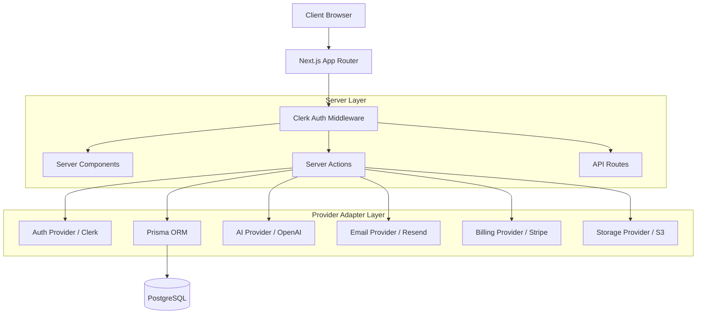

# Architecture

Fatoora AI follows a modern, scalable Serverless architecture optimized for the Next.js App Router paradigm. 

## Stack Overview

- **Framework**: Next.js 16 (App Router)
- **Language**: TypeScript
- **Database**: PostgreSQL (Neon/Supabase)
- **ORM**: Prisma (v5)
- **Styling**: Tailwind CSS + shadcn/ui
- **Authentication**: Clerk (B2B Multi-tenant implementation)
- **State/Mutations**: React Hook Form + Zod + Next.js Server Actions

## Core Architecture Diagram

## Provider Abstraction

We utilize a robust provider abstraction pattern (`src/lib/providers/`) to separate business logic from external SDK implementations. This allows the application to gracefully degrade to `MockProviders` when run locally without API keys, but enforces strict `RealProviders` in production via `src/lib/env.ts` validation.

## Tenant Isolation

Fatoora AI is a B2B SaaS. Every data entity (Invoice, Customer, Expense) is owned by an `Organization`, not a `User`. 

1. User authenticates via Clerk.
2. User selects an active `Organization`.
3. `requireOrganization()` helper runs on the server.
4. Database queries **always** scope to `where: { organizationId }`.

This ensures mathematical impossibility of cross-tenant data leakage.
